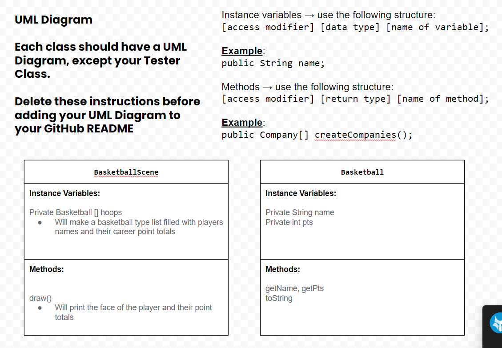
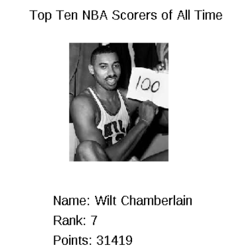

# Unit 4 - Abstract Art Project

## Introduction

Data visualizations are powerful tools to present information and convey patterns and relationships. Sometimes visualizations are charts or graphs, and other times they are more abstract pieces of art. Your goal is to create a visual representation relating at least two categories from your dataset that engages your viewer and encourages them to learn more about your chosen topic.

## Requirements

Use your knowledge of object-oriented programming, one-dimensional (1D) arrays, and algorithms to create your data visualization program:

- **Create at least two 1D arrays** – Create at least two 1D arrays to store the data that will make up your visualization.
- **Implement one or more algorithms** – Implement one or more algorithms that use two-way or multi-selection statements with compound Boolean expressions to analyze the data.
- **Use methods in the Math class** – Use one or more methods in the Math class in your program, such as to perform calculations on the values in your dataset and display the results, choose random values from the dataset, or display images or shapes at random locations.
- **Create a visualization** – Create an image or animation that conveys the story of the data by illustrating the patterns or relationships in the data.
  Note: This may be abstract! Others do not necessarily need to know what the story or pattern is right away, but you do need to be able to explain it to them.
- **Document your code** – Use comments to explain the purpose of the methods and code segments and note any preconditions and postconditions.

## Dataset

Include a hyperlink to the source of your dataset used for this project. Additionally, provide a short description of each column used from the dataset, and the data type.

Example:

Dataset: https://www.kaggle.com/datasets/isaienkov/nba-top-50-alltime-scorers

- **Name** (String) - Name of the player
- **Rank** (int) - All time point ranking
- **Points** (int) - Total points

## UML Diagram

()

## Video Demo

Record a short video of your abstract art animation to display here on your README. You can do this by:

- Screen record your project running on Code.org.
- Upload that recording to YouTube.
- Take a thumbnail for your image.
- Upload the thumbnail image to your repo.
- Use the following markdown

[Click here to view my project)]([youtube-URL-here](https://youtube.com/shorts/Hbi8Du1KOdY?si=cUO_GPp344PwEK_T))

## Description

This project utilized the theater class as well as arrays and multi-selection statements in order to create an application which picks a random NBA player in the top 10 NBA scorers of all time and produces information regarding their rank, name, and point total along with an image of the player. I decided to make this program because I love basketball and wanted to use the information I gained in computer science to make a meaningful application to me. 
